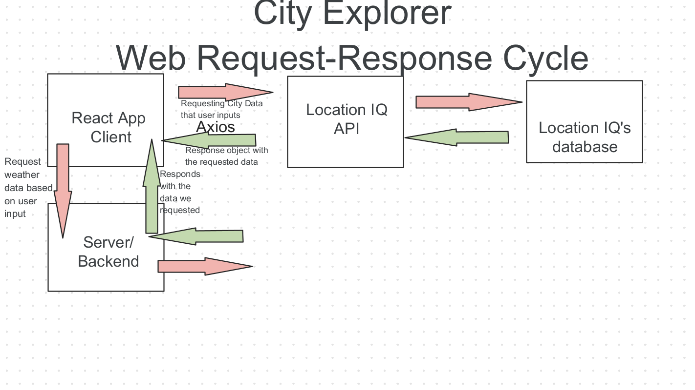

# City Explorer

**Author**: Dougie Douglas
**Version**: 2.0.0 (increment the patch/fix version number if you make more commits past your first submission)

## Overview

- This application uses Axios, Location IQ, and personal server APIs to provide information to the user about a search location of their choice.

## Getting Started

- [City Explorer Trello](https://trello.com/b/KN8qGMon/dougies-city-explorer)

## Architecture

- Written with React
- Styled with CSS and Bootstrap
- Uses Axios for a promise-based HTTP client
- LocationIQ API used for location data

## Change Log

05-12-2022 10:54pm -
LocationIQ API integrated to render map/name/lat/lon of queried city.

05-14-2022 07:35pm -
Local server created to host weather data for user.

## Credit and Collaborations

- Special thanks to Zayah Lang for helping me debug.

Name of feature: Lab: Class 07, Weather Integration

Estimate of time needed to complete: 4 hours

Start time: 14 May @ 1500

Finish time: 14 May @ 2000

Actual time needed to complete: Approx. 5 hours
